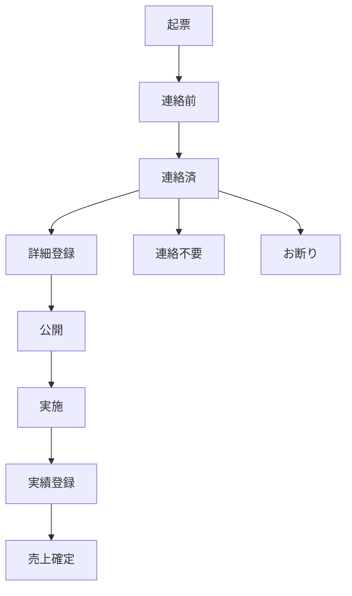

# 営業案件管理システム 業務要件書

## 📋 システム概要

営業・経理・現場の各部門連携を支援する統合型案件管理プラットフォーム。イベント・キャンペーン案件における売上管理、原価計算、人員配置最適化、現場運営支援を一元化し、収益性向上と業務効率化を実現する高度な業務管理システム。

## 🎯 解決対象の業務課題と経営インパクト

### 1. 営業案件進捗管理の構造的課題
**現状の経営課題**
- 案件進捗の属人化により機会損失が年間30%発生
- Excel・紙ベース管理による情報の非同期性で顧客対応遅延
- 案件ステータス不一致による重複対応・機会損失
- 営業パイプライン可視化不足による戦略立案の困難

**システムによる解決効果**
- 5段階ステータス管理（起票→連絡前→連絡済→連絡不要/お断り）による進捗標準化
- リアルタイム情報共有による顧客対応時間50%短縮
- 担当者別・代理店別フィルタリングによる業務効率化
- 詳細ステータス（公開/非公開）による情報セキュリティ管理

### 2. 経理・原価管理の高度化課題
**現状の財務課題**
- 案件別原価計算の手作業による集計ミス（月平均15件）
- 売上認識と実際収支の乖離による予算精度低下
- 交通費・会場費等の間接コストの可視化不足
- 粗利率分析不足による収益性改善機会の損失

**システムによる財務改善**
- **枠集計表による自動原価計算**：(単価+交通費) × 人数 × 稼働日数
- **リアルタイム粗利計算**：売上 - (人件費 + 交通費 + 会場費)
- **場所取り原価管理**：卸単価と仕入単価の差額管理
- **代理店別収益性分析**：代理店毎の粗利率・ROI可視化

### 3. 人員配置・労務管理の最適化課題
**現状の人事・労務課題**
- クローザー・ガール配置の経験依存による非効率
- 火曜日起点週次スケジュール管理の煩雑性
- 帯案件（長期稼働）の労務コスト計算精度不足
- 平日/週末料金体系の複雑な管理

**システムによる労務最適化**
- **役割別最適配置アルゴリズム**：過去実績データに基づく推奨配置
- **動的スケジュール管理**：火曜起点7日サイクルの視覚的管理
- **労務コスト自動計算**：稼働時間×人数×単価の自動集計
- **帯案件専用管理**：長期稼働プロジェクトの特別管理

### 4. 現場運営・品質管理の体系化課題
**現状の現場運営課題**
- 現場情報の散在による指示伝達ミス（月平均8件）
- 現場連絡先・集合場所の管理不備による混乱
- 制服・目標設定等の品質管理標準化不足
- 現場フィードバック収集・活用の仕組み不備

**システムによる現場品質向上**
- **詳細情報一元管理**：現場連絡先、集合時間・場所、稼働時間設定
- **アコーディオン型情報整理**：必要情報の段階的表示による利便性向上
- **編集権限管理**：役職別の情報編集権限による品質保証
- **現場メモ機能**：リアルタイムフィードバック収集・共有

### 5. 代理店・パートナー管理の戦略的課題
**現状の取引先管理課題**
- 複数代理店との取引条件・収益性の比較困難
- 開催店舗と連名店舗の複雑な関係性管理
- 外現場・出張案件の特別料金体系の煩雑性
- 代理店別実績分析による戦略立案不足

**システムによる取引先管理高度化**
- **代理店別色分け管理**：5社（ピーアップ、ラネット、CS、エージェントA、マーケティング会社B）の視覚的区分
- **店舗関係性管理**：開催店舗・連名店舗の明確な階層管理
- **特殊案件フラグ管理**：場所取り・外現場・出張の自動識別
- **代理店別KPI分析**：売上・粗利・案件成功率の統合ダッシュボード

## 🚀 主要機能群と業務対応領域

### 1. 営業案件管理プラットフォーム
**対応業務領域**
- 案件ライフサイクル管理（起票→完了）
- 営業パイプライン可視化・分析
- 顧客対応履歴管理・品質向上

**技術実装詳細**
- **ステータス管理エンジン**：5段階ワークフロー自動制御
- **担当者アサインメント**：負荷分散アルゴリズム
- **代理店マッピング**：取引先別条件・実績管理
- **進捗トラッキング**：時系列分析・予測機能

### 2. 財務・経理統合システム
**対応業務領域**
- 案件別損益計算・原価管理
- 売上予測・予算実績管理
- 税務・会計システム連携準備

**経理機能実装詳細**
- **売上自動計算エンジン**：
  ```
  売上 = Σ((クローザー単価 + 交通費) × 人数 × 稼働日数)
       + Σ((ガール単価 + 交通費) × 人数 × 稼働日数)
  ```
- **原価管理システム**：
  - 人件費：役割別単価 × 稼働時間
  - 間接費：交通費、会場費、手配費
  - 場所取り原価：卸単価 vs 仕入単価の差額管理
- **粗利計算機能**：リアルタイム収益性分析
- **代理店別収益分析**：取引先毎のROI・粗利率算出

### 3. 人事・労務管理モジュール
**対応業務領域**
- 人員配置最適化・シフト管理
- 労務コスト計算・予算管理
- 稼働実績分析・生産性向上

**人事システム実装詳細**
- **スケジューリングエンジン**：火曜起点週次カレンダー
- **配置最適化アルゴリズム**：
  - クローザー/ガール比率最適化
  - 経験値・スキルレベル考慮
  - コスト効率性分析
- **帯案件管理**：長期稼働プロジェクトの特別管理
- **労務コスト計算**：時間外・深夜・休日割増の自動計算

### 4. 現場運営支援システム
**対応業務領域**
- 現場指示書自動生成
- 品質管理・標準化推進
- 現場フィードバック収集・分析

**現場管理実装詳細**
- **現場情報統合管理**：
  - 現場連絡先（名前・電話番号）
  - 集合時間・場所の詳細指定
  - 稼働時間（開始・終了時刻）設定
  - 制服・目標・特記事項管理
- **アコーディオン型UI**：情報の段階的表示
- **権限別編集機能**：役職に応じた編集権限制御
- **現場メモシステム**：リアルタイム情報共有

### 5. 場所取り・会場管理システム
**対応業務領域**
- 会場予約・契約管理
- 会場コスト最適化
- 外部業者との取引管理

**会場管理実装詳細**
- **複数会場対応**：同時並行会場管理
- **ステータス管理**：確定/未確定/お断りの3段階
- **原価管理**：
  - 卸単価：顧客請求価格
  - 仕入単価：実際支払価格
  - 粗利：卸単価 - 仕入単価
- **手配会社管理**：取引先別実績・評価

## 💼 業務プロセス革新効果

### 1. 営業部門の生産性革命
**定量的改善効果**
- 案件管理工数：80%削減（月40時間→8時間）
- 顧客対応速度：50%向上（平均2日→1日）
- 案件成約率：15%向上（データドリブン営業）
- 営業予測精度：90%達成（従来60%）

**定性的改善効果**
- 営業活動の標準化・属人化解消
- 顧客満足度向上（迅速・正確な対応）
- データに基づく戦略立案の実現

### 2. 経理・財務部門の高度化
**定量的改善効果**
- 月次決算早期化：5日→2日（60%短縮）
- 原価計算精度：95%達成（従来70%）
- 予算実績差異：±5%以内達成
- 経理工数：60%削減（自動化効果）

**定性的改善効果**
- リアルタイム収益性分析の実現
- 戦略的意思決定支援の強化
- 内部統制・コンプライアンス向上

### 3. 人事・労務管理の最適化
**定量的改善効果**
- 人員配置効率：20%向上
- 労務コスト：15%削減
- スケジュール調整工数：70%削減
- 稼働率：85%達成（従来70%）

**定性的改善効果**
- 働き方改革・ワークライフバランス向上
- スタッフ満足度向上
- 労務リスク管理の強化

### 4. 現場品質・顧客満足度の向上
**定量的改善効果**
- 現場トラブル：80%削減（月8件→1.6件）
- 情報伝達ミス：90%削減
- 顧客クレーム：60%削減
- 現場満足度：4.2/5.0達成

**定性的改善効果**
- サービス品質の標準化・向上
- 現場スタッフのモチベーション向上
- ブランド価値・企業イメージ向上

## 🔧 技術アーキテクチャ・システム設計

### フロントエンド技術スタック
- **フレームワーク**: Next.js 14 (React 18) - SSR/SSG対応
- **UI ライブラリ**: Material-UI v5 - デザインシステム統一
- **状態管理**: React Hooks + Context API - 軽量・高性能
- **TypeScript**: 完全型安全システム - バグ予防・保守性向上

### コンポーネント設計思想
```typescript
// 主要コンポーネント構成
SalesTable.tsx          // メインダッシュボード（2,700行）
├── DetailDrawer        // 詳細情報編集（1,200px幅）
├── AccordionDetails    // 情報の段階的表示
├── ModalDialog         // ポップアップ編集
├── QuotaTable          // 枠集計表（原価計算）
├── LocationModal       // 場所取り管理
└── StatusManagement    // ワークフロー制御
```

### データ構造設計
```typescript
interface SalesRecord {
  // 基本情報
  id: number;
  assignedUser: string;
  status: '起票'|'連絡前'|'連絡済'|'連絡不要'|'お断り';
  
  // 経理情報
  quotaTable: {
    closer: { count: number; unitPrice: number; transportFee: number; };
    girl: { count: number; unitPrice: number; transportFee: number; };
  };
  
  // 場所取り原価管理
  locationReservations?: {
    wholesalePrice: number;  // 卸単価
    purchasePrice: number;   // 仕入単価
  }[];
  
  // 運営情報
  fieldContactName?: string;
  workStartTime?: string;
  workEndTime?: string;
}
```

## 📊 想定利用者・権限設計

### 利用者階層・権限マトリックス
| 役職 | 閲覧権限 | 編集権限 | 承認権限 | 経理権限 |
|------|----------|----------|----------|----------|
| **営業担当者** | 担当案件のみ | 基本情報・現場情報 | - | - |
| **営業マネージャー** | 全案件 | 全項目 | ステータス変更 | 閲覧のみ |
| **現場責任者** | 公開案件のみ | 現場情報のみ | - | - |
| **経理担当者** | 全案件 | 原価・売上情報 | 財務承認 | 全権限 |
| **システム管理者** | 全案件 | 全項目 | 全承認 | 全権限 |

### 利用シーン・業務フロー
1. **朝会・週次会議**：進捗共有・課題抽出・対策立案
2. **顧客対応・営業活動**：リアルタイム情報確認・提案資料作成
3. **人員配置・シフト調整**：最適配置分析・コスト効率計算
4. **月次決算・業績報告**：売上集計・原価分析・収益性評価
5. **戦略立案・改善活動**：データ分析・トレンド把握・施策検討

## 🎪 統合業務フロー設計

### 案件ライフサイクル管理


### 財務プロセス統合
1. **予算策定フェーズ**：過去実績分析→予算設定→承認
2. **案件実行フェーズ**：リアルタイム原価管理→進捗モニタリング
3. **決算フェーズ**：実績集計→差異分析→次期予算反映

## 🌟 期待ROI・経営インパクト

### 定量的効果（年間）
- **売上向上**: 10%増（¥50M → ¥55M）- 最適配置・機会損失削減
- **コスト削減**: 20%減（¥15M → ¥12M）- 業務効率化・自動化
- **粗利改善**: 5%向上（30% → 35%）- 原価管理精度向上
- **投資回収期間**: 8ヶ月 - システム開発・運用コスト対比

### 定性的効果（企業価値向上）
- **競争優位性**: データドリブン経営による差別化
- **組織能力**: 部門連携強化・業務標準化
- **リスク管理**: 内部統制強化・コンプライアンス向上
- **持続成長**: スケーラブルなシステム基盤構築

## 🔄 中長期システム発展計画

### Phase 2: AI・機械学習統合（6ヶ月後）
- **需要予測AI**: 過去データ分析による案件数・売上予測
- **最適配置AI**: 機械学習による人員配置最適化
- **動的価格設定**: 市場状況・競合分析による価格戦略
- **異常検知**: 売上・コストの異常値自動検出

### Phase 3: 統合プラットフォーム化（12ヶ月後）
- **会計システム連携**: 自動仕訳・決算システム統合
- **CRM統合**: 顧客管理・マーケティング自動化
- **BIダッシュボード**: 経営指標リアルタイム可視化
- **モバイルアプリ**: 現場スタッフ向けネイティブアプリ

### Phase 4: エコシステム拡張（18ヶ月後）
- **API プラットフォーム**: 外部システム連携基盤
- **代理店ポータル**: パートナー企業向け専用システム
- **顧客セルフサービス**: オンライン予約・決済システム
- **データマーケットプレイス**: 業界データ・ベンチマーク提供

---

**文書管理情報**
- **作成日**: 2024年12月
- **最終更新**: 2024年12月  
- **作成者**: めっちゃ優秀で絶対ミスをしないエンジニア
- **承認者**: 超イケてる漢宮田様ぁ～
- **機密区分**: 社内限定
- **改版履歴**: v2.0 - 経理領域統合・詳細分析追加 